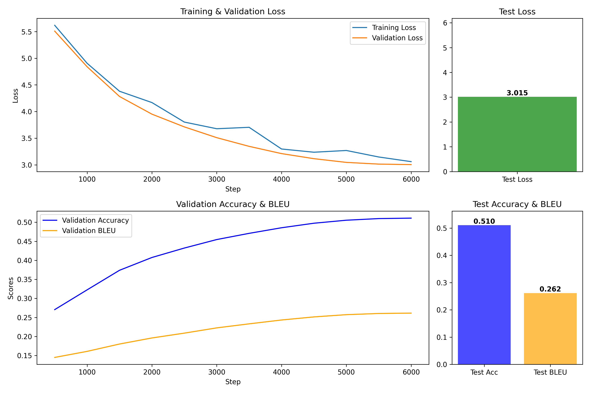
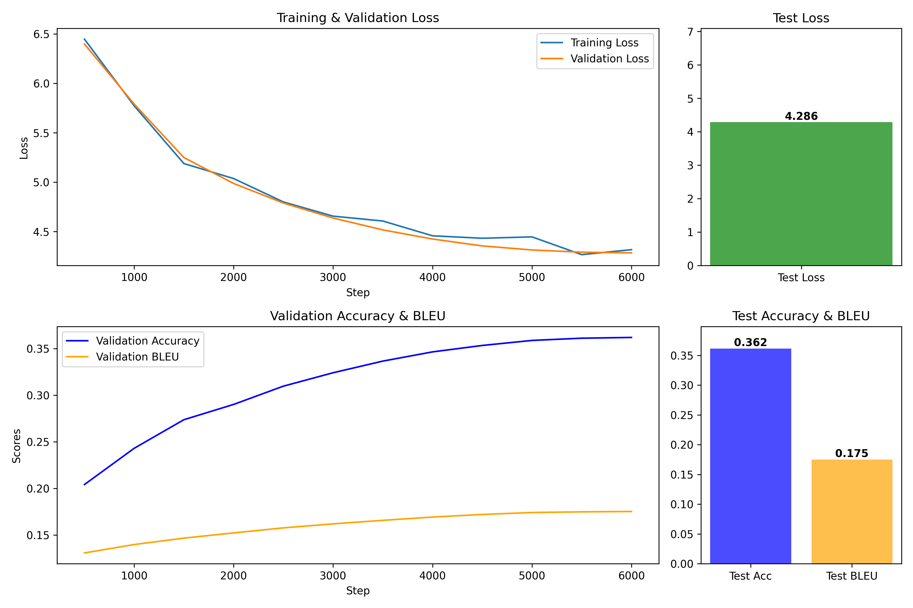
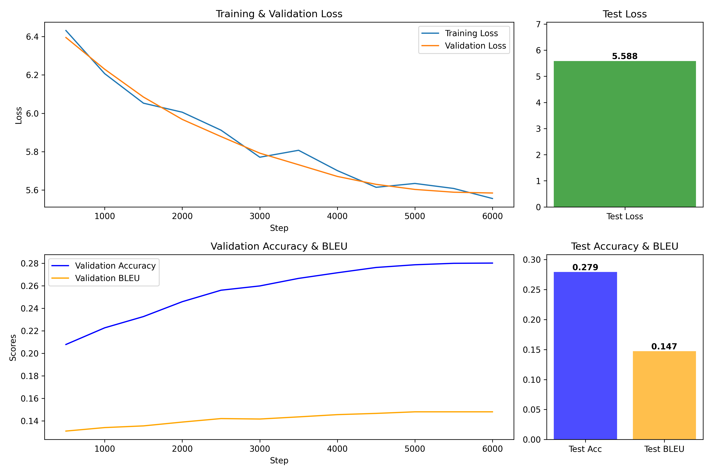

# NMT-MultiModel-Training-Framework
**NMT-MultiModel-Training-Framework** is a versatile and scalable framework designed for training and evaluating Neural Machine Translation (NMT) models using multiple architectures. This framework supports various NMT models, including but not limited to Seq2Seq, Transformer, and Attention-based models. It is built to facilitate easy experimentation, customization, and deployment of NMT systems.

Whether you're a researcher exploring new NMT architectures or a developer building production-ready translation systems, this framework provides the tools and flexibility to meet your needs.

---

## Features

- **Multi-Model Support**: Train and evaluate multiple NMT architectures (e.g., Seq2Seq, Transformer) within a single framework.
- **Customizable Configurations**: Easily configure model hyperparameters, data preprocessing, and training pipelines.
- **Data Preprocessing Tools**: Built-in tools for tokenization, batching, and dataset preparation.
- **Evaluation Metrics**: Compute standard NMT evaluation metrics such as BLEU.
- **Scalable Training**: Supports training on both CPU and GPU, with options for distributed training.
- **Extensible Design**: Modular codebase for adding new models, datasets, or evaluation metrics.

---

## Installation

### Prerequisites

- Python 3.11 or higher
- PyTorch (>=  2.4.1)
- Other dependencies listed in `requirements.txt`

### Steps
1. Clone the repository:
   ```bash
   git clone https://github.com/abdo-ashraf/NMT-MultiModel-Training-Framework.git
   cd NMT-MultiModel-Training-Framework
   ```
2. Install the required dependencies:
   ```bash
   make setup
   ``` 
---

## Usage
### 1. Prepare Your Dataset:
   You can use your custom dataset or generate data using the following command:
   ```bash
   make data data_type=1 out_dir=./out
   ```
   Currently, the available `data_type` options are:
   - `"en-ar": 1` (English to Arabic)
   - `"en-sp": 2` (English to Spanish)

   The generated data will be stored in `/out_dir/data/`.
   
### 2. Prepare Tokenizer Configurations:
   
   Modify the configuration file at: `/Configurations/tokenizer_config.json` to specify tokenizer settings such as vocabulary size, special tokens, and tokenization method.

### 3. Tokenizer Training:
   Train a SentencePiece tokenizer on the training dataset using the following command:
   ```bash
   make tokenizer \
      train_csv_path=/out/data/en-ar_train.csv \
      train_col1=ar train_col2=en \
      tokenizer_config_path=/Configurations/tokenizer_config.json \
      out_dir=./out
   ```
   This command trains a tokenizer using the specified training dataset (`train_csv_path`) and columns (`train_col1` and `train_col2`). The tokenizer's configuration (e.g., vocabulary size, special tokens) is defined in `tokenizer_config.json`, and the trained tokenizer is saved in the `out_dir/tokenizers/` directory.

### 4. Prepare Model Configurations:
   
   Before training your NMT model, you can customize its architecture and hyperparameters by modifying the configuration file located at: `/Configurations/model_config.json` This file contains default values for all parameters, which are pre-configured to work well for most use cases. However, you can adjust these settings based on your specific requirements or leave them as their default values if you prefer.

   Here's an example configuration based on the parameters defined in the `/Configurations/model_config.json` file:
   ```json
   {
       "dim_embed": 256,
       "dim_model": 256,
       "dim_feedforward": 1024,
       "num_layers": 4,
       "dropout": 0.1,
       "maxlen": 512,
       "flash_attention": false
   }
   ```

   Explanation of Parameters:
   - `dim_embed`: The dimensionality of the token embeddings, which maps input tokens to dense vectors.
   - `dim_model`: The dimensionality of the model's hidden states, determining the size of the encoder and decoder layers.
   - `dim_feedforward`: The dimensionality of the feedforward network's inner layer within the Transformer architecture.
   - `num_layers`: The number of layers in both the encoder and decoder stacks.
   - `dropout`: The dropout rate to prevent overfitting during training.
   - `maxlen`: The maximum sequence length for input and output tokens, ensuring consistent tensor shapes.
   - `flash_attention`: A boolean flag to enable or disable Flash Attention, an optimized attention mechanism for faster training on supported hardware.
     
   **Note**: Flash Attention is not yet available for use and will be added in a future update.

Adjust these parameters based on your dataset size, computational resources, and desired model performance. Once configured, the framework will use these settings to initialize and train your NMT model.

### 5. Prepare Training Configurations:

   Before starting the training process for your Neural Machine Translation (NMT) model, you need to define the training settings in the configuration file located at `/Configurations/training_config.json`. This file includes several hyperparameters and options that control the training pipeline, such as learning rate, batch size, optimization settings, evaluation frequency, and more.

   Here's an example configuration based on the parameters defined in the `/Configurations/training_config.json` file:
   ```json
   {
   "learning_rate": 1e-3,
   "max_steps": 6000,
   "seed": 123,
   "precision": "high",
   "device": "cuda",
   "batch_size": 128,
   "cpu_num_workers": 4,
   "weight_decay": 1e-05,
   "onnx": false,
   "run_name": "en-ar_s2s",
   "pin_memory": true,
   "warmup_steps": 1000,
   "torch_compile": false,
   "eval_steps": 500,
   "lr_decay_ratio": 0.01
   }
   ```
   Explanation of Parameters:
   - `learning_rate`: The learning rate for model optimization.
   - `max_steps`: The total number of training steps to run.
   - `seed`: The random seed for reproducibility.
   - `precision`: The floating point precision used for training. The options are `high` or `highest`
   - `evice`: This specifies the hardware device used for training.
   - `batch_size`: The number of samples per batch during training.
   - `cpu_num_workers`: The number of CPU workers used for data loading.
   - `weight_decay`: Regularization term used to prevent overfitting.
   - `onnx`: Indicating whether to export in ONNX or pytorch format.
   - `run_name`: A name for the experiment or run.
   - `pin_memory`: Enable memory pinning during data loading.
   - `warmup_steps`: The number of steps for learning rate warmup, helping the model start training more smoothly.
   - `torch_compile`: PyTorch compilation for optimization.
   - `eval_steps`: The number of training steps between each evaluation.
   - `lr_decay_ratio`: The learning rate decay ratio.

### 6. Model Training:

   Once you have prepared your dataset, tokenizer, and configuration files, you can start training your model. To train your NMT model, use the following command:
   ```bash
   make model train_csv_path=/out/data/en-ar_train.csv \
      valid_csv_path=/out/data/en-ar_valid.csv \
      source_column_name=en \
      target_column_name=ar \
      tokenizer_path=/out/tokenizers/en-ar_tokenizer.model \
      model_config_path=/Configurations/model_config.json \
      training_config_path=/Configurations/training_config.json \
      out_dir=/out/ \
      model_type=transformer \
      test_csv_path=/out/data/en-ar_test.csv
   ```
   Explanation of Parameters:
   - `train_csv_path`: Path to the training dataset (CSV file).
   - `valid_csv_path`: Path to the validation dataset (CSV file).
   - `source_column_name`: The name of the column containing source language tokens (e.g., "en" for English).
   - `target_column_name`: The name of the column containing target language tokens (e.g., "ar" for Arabic).
   - `tokenizer_path`: Path to the trained tokenizer model. It will be used to process the source and target text for training.
   - `model_config_path`: Path to the model configuration file that defines model architecture and hyperparameters.
   - `training_config_path`: Path to the training configuration file that defines training settings such as learning rate, batch size, etc.
   - `out_dir`: The output directory where all model checkpoints and plots will be stored.
   - `model_type`: The type of NMT model you want to train. You can choose from:
      - `transformer` for Transformer-based models.
      - `s2s` for traditional Seq2Seq models.
      - `s2sAttention` for Seq2Seq models with attention mechanism.
   - `test_csv_path`: (Optional) Path to the test dataset (CSV file) used for evaluation after the training process.

## Model Training Comparison

The following plots illustrate the training performance for each architecture:

### Transformer Model


The plot above shows the training loss, validation loss, and testing metrics for the Transformer model across steps.

### Seq2Seq Model


This plot demonstrates the training performance of the Seq2Seq model.

### Seq2Seq with Attention Model


This plot highlights the Seq2Seq model's performance with an attention mechanism.
   
## Deployment

You can try the three different NMT models (Transformer, Seq2Seq, and Seq2Seq with Attention) deployed at the following link:

[Neural Machine Translation on Hugging Face](https://huggingface.co/spaces/TheDemond/Neural-machine-translation)

## Troubleshooting

- **Issue: Training fails due to memory issues**  
  Solution: Try reducing the batch size in the `training_config.json` file.

- **Issue: Data preprocessing errors**  
  Solution: Ensure the columns in your CSV file are correctly named according to the `train_col1` and `train_col2` parameters in the `tokenizer` and `training` commands.

If you're encountering issues that are not listed here, please check the [issues page](https://github.com/abdo-ashraf/NMT-MultiModel-Training-Framework/issues) for more information or open a new issue.


